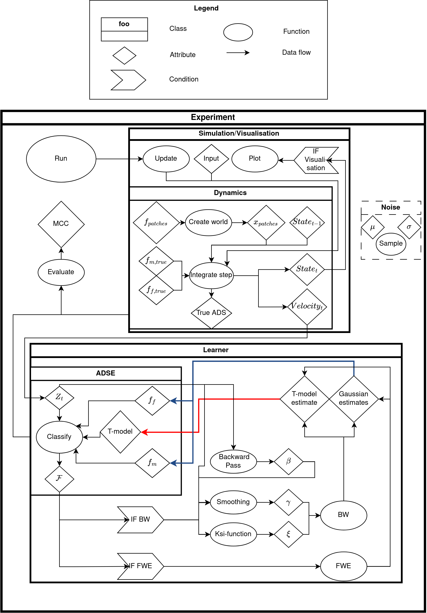
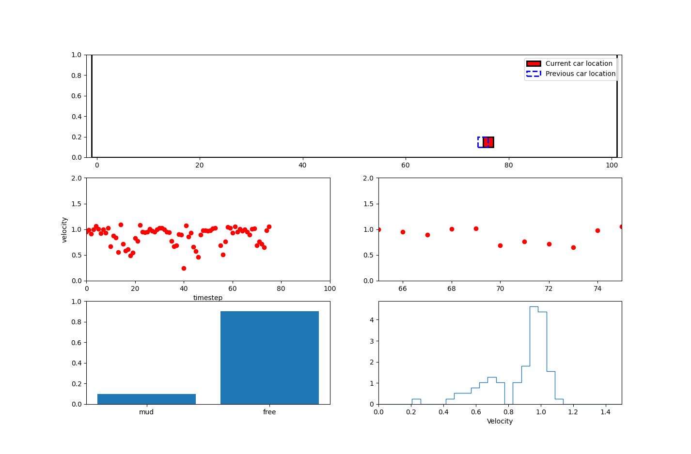

# Abstract Discrete State Estimation (ADSE)

## Introduction

This repository contains the code used for my [thesis](https://repository.tudelft.nl/islandora/object/uuid%3A189b4626-ab70-40da-aedf-499181337927?collection=education) *Digging through the Dirt:a General Method for Abstract Discrete State Estimation with Limited Prior Knowledge* . The following is a small introduction to the concept of abstract discrete states, taken from the abstract:

>Autonomous robots are often successfully deployed in controlled environments. Operation in uncontrolled situations remains challenging; it is hypothesized that the detection of abstract discrete states (ADS) can improve operation in these circumstances. ADS are high-level system states that are not directly detectable and influence system dynamics. An example of a typical ADS problem that is used in this thesis is that of a wheeled robot driving through puddles of mud that, when entered, alters the velocity of the robot. When the robot is in such a puddle, it is in an ADS ’mud’, and when it is not, it is in an ADS ’free’. ADS can be indirectly inferred through the analysis of lower-level data such as the velocity of the robot.

This repository contains code to experiment with this concept, ultimately on how to estimate these ADS, which is done using Gaussian hidden Markov models (GHMM). A GHMM is a [hidden Markov model](https://en.wikipedia.org/wiki/Hidden_Markov_model) (HMM) with normally distributed emissions. Learning of the GHMM parameters is done by either the Baum-Welch (BW) algorithm or the Forward Extraction (FWE) algorithm.

## Project structure

The main code for running ADSE simulations consists of the following files:

- *dynamics.py*, a class that describes the environment and handles the dynamics (in other words, the movement of the robot). This includes generating patches of mud.  

- *adse.py*, the ADSE handles the classification of ADS from velocity data: the function ’Classify’ is essentially a forward pass. 

- *learner.py*, this class handles the learning process of the ADSE for either BW or FWE learning. For BW this includes the backward pass, smoothing, and the calculation of the ξ-function. The class is built on an ADSE object.  

- *noise.py*, a utility class building on SciPy (scipy.stats.norm). This class contains functions for easier manipulation of scipy.stats.norm objects. This class is used as an attribute in both Dynamics and ADSE.  

- *simulation.py/visualization.py*, either a Simulation or Visualization object can be used. This is a driver class for Dynamics and the ADSE. It handles the input, which can be directly from a keyboard or from data. A Visualization adds various real-time plots to a Simulation, including a world plot with the robot movement, histogram and current ADS estimate. Furthermore, the Simulation/Visualization calls the ADSE to classify on the velocity data on each timestep coming from the Dynamics.  

- *experiment.py*, a class containing and connecting a Simulation, Learner and ADSE object. It is used for easy running of multiple experiments with multiple settings. Furthermore, this contains functions to evaluate the performance of the ADSE and functions for handling and plotting data. 

Furthermore, there are a few files for the evaluation of experiment results:

- *data_handler.py*, extracts and sorts useful data out of experiment data files.
- *evaluation.py*, contains functions to visualize the data sorted by *data_handler.py*.

An overview of how the different files interacts can be found below:

## Running

First create and activate a fresh virtual environment:
~~~
python -m venv your_venv  
source your_venv/bin/activate
~~~

Install the requirements:

~~~
pip install -r requirements.txt
~~~

Try running visualization.py:

~~~
cd adse  
python visualization.py
~~~

You should see something like this:

